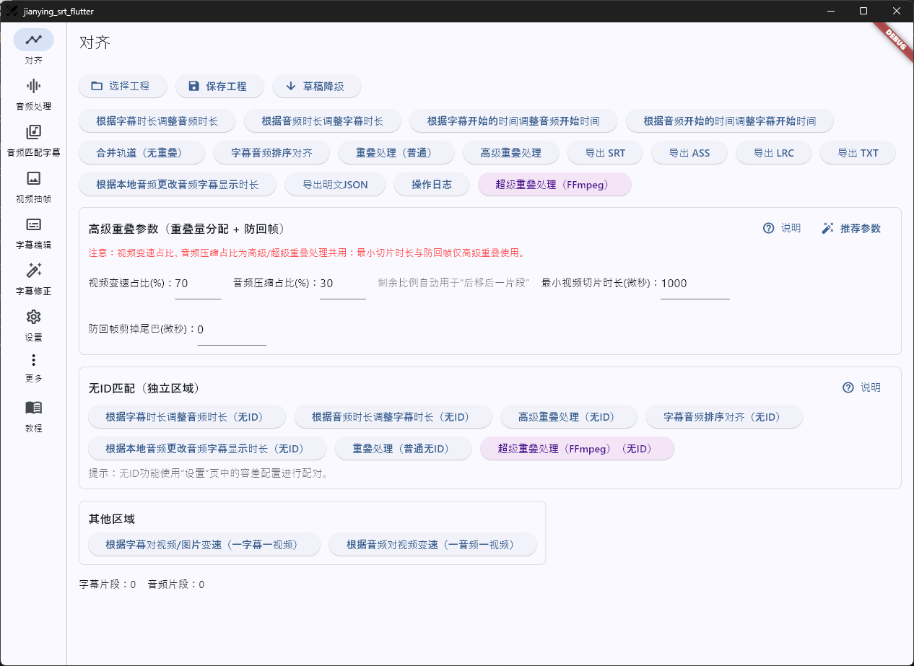
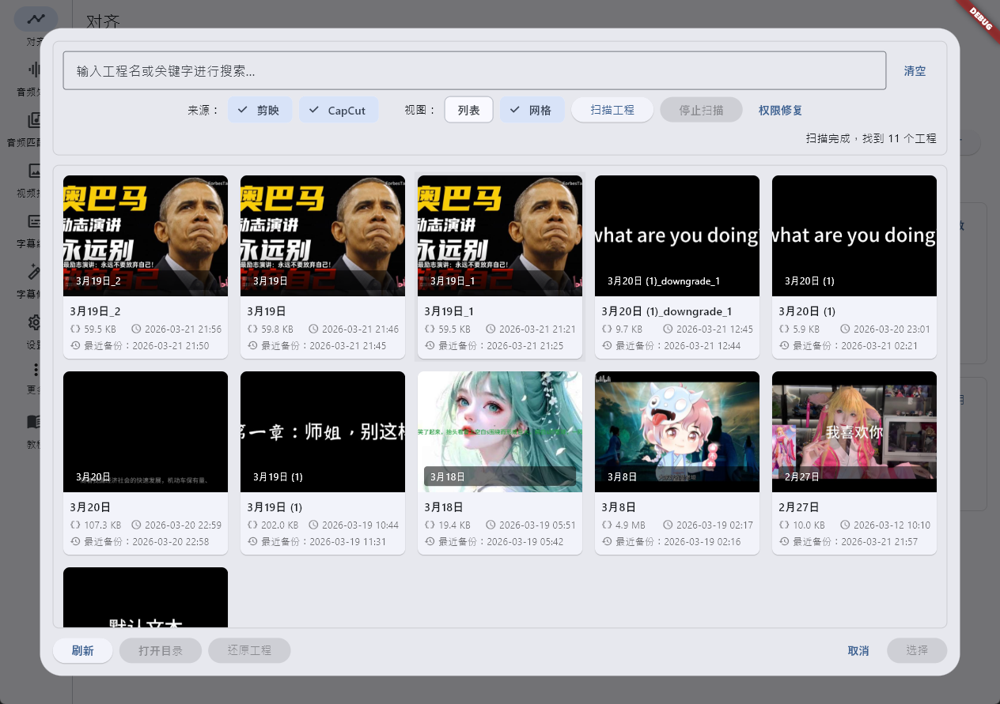
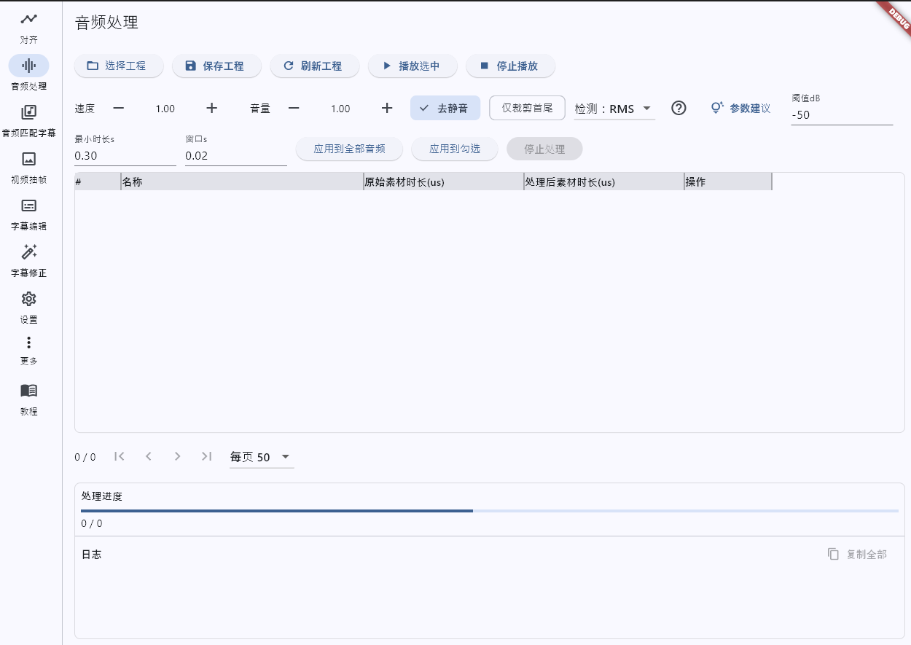
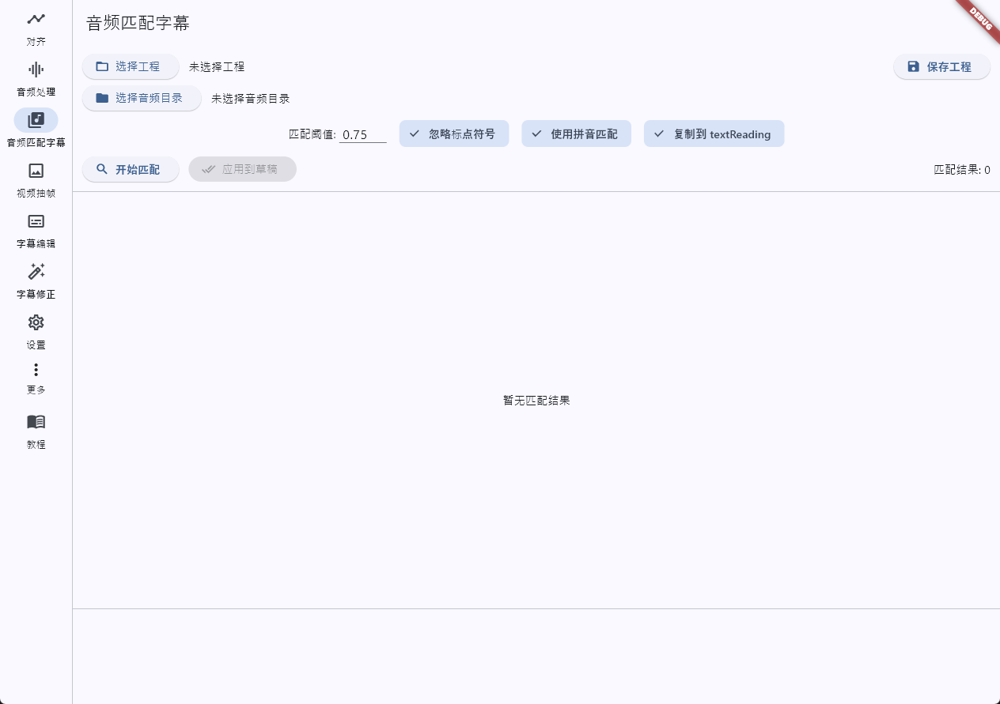
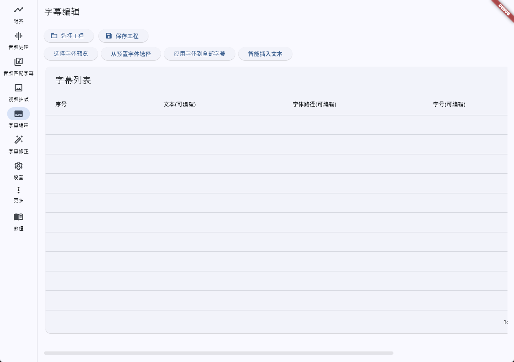
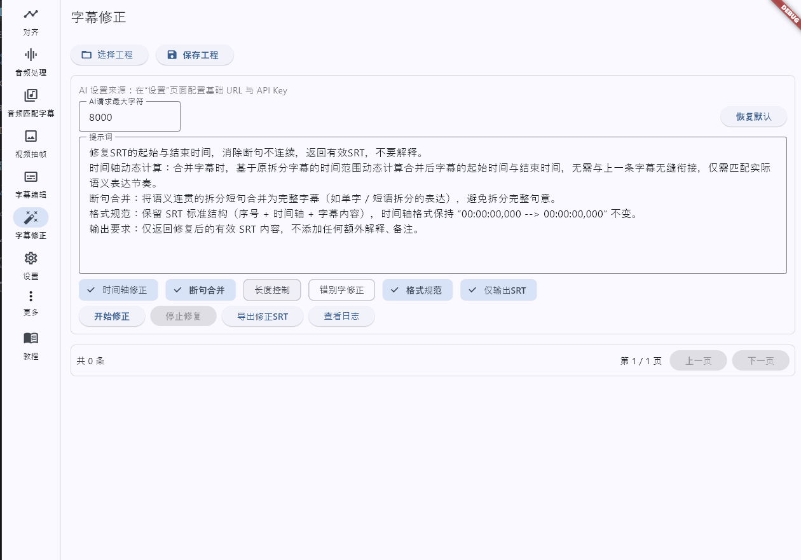
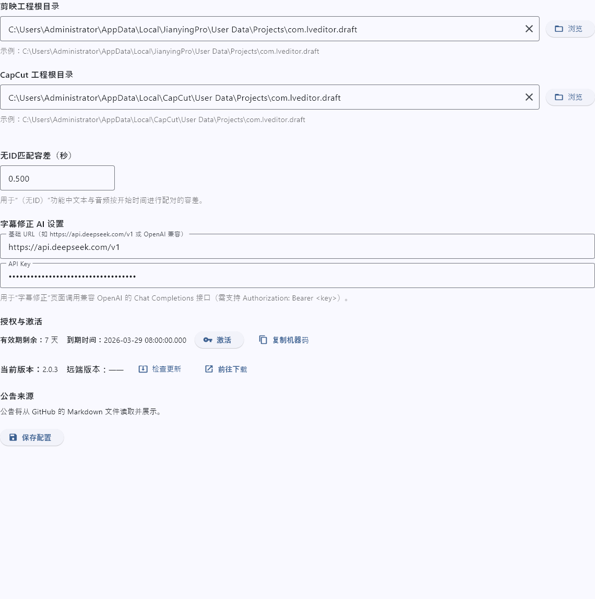
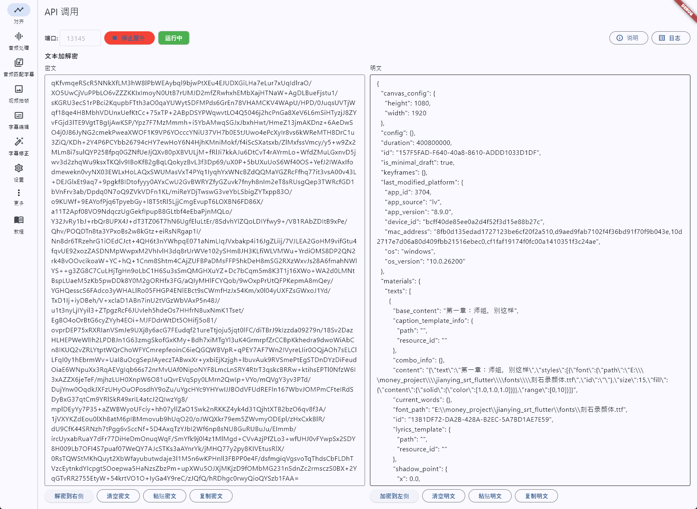

**试用一个月｜欢迎联系**

- QQ：2106359814
- 微信：Dengboliaini
- 闲鱼： https://m.tb.cn/h.7HKRtPF?tk=rF1nUQ5Buba

---

# 剪映字幕对齐工具

这是一个用于调整剪映工程文件中字幕时长的PyQt5应用程序，可以解决文本转语音后音频时长与字幕显示时长不匹配的问题。

- ## 功能概览

  - 对齐页
    - 选择工程 / 保存工程 / 操作日志（可回退）
    - 根据字幕时长调整音频时长
    - 根据音频时长调整字幕时长
    - 根据字幕开始时间调整音频开始时间
    - 根据音频开始时间调整字幕开始时间
    - 合并轨道（无重叠，支持音频与文本）
    - 字幕音频排序对齐（按开始时间排布并消除重叠）
    - 重叠处理（普通 / 高级）
    - 超级重叠处理（FFmpeg）（支持有ID与无ID）
    - 导出字幕：SRT、ASS、LRC、TXT
    - 导出明文 JSON
    - 根据本地音频更改音频字幕显示时长（按 ID 对应，批量；流程为“探测→写回→同步”）
    - 根据本地音频更改音频字幕显示时长（无ID，按开始时间容差配对，批量；流程为“探测→写回→配对→同步”）
    - 根据字幕对视频/图片变速（一字幕一视频）、根据音频对视频变速（一音频一视频）
    - 草稿降级（复制工程后对草稿格式降级）
    - 说明弹窗（无ID配对规则与生效范围）
  - 音频处理页
    - 批量处理工程内音频素材：变速、音量、去静音（silenceremove）
    - 进度条与日志实时更新
    - 应用到全部音频 / 应用到勾选
    - 停止处理（可随时取消任务）
    - 多选播放与单条播放
  - 音频匹配字幕页
    - 扫描外部音频目录，按文本相似度（可选拼音、忽略标点）与字幕内容进行匹配
    - 支持设置匹配阈值，试听音频，按开始时间排序查看匹配结果
    - 可选择将匹配音频复制到工程目录 textReading，并一键应用到草稿（自动创建音频素材与片段）
  - 视频抽帧页
    - 批量导入视频，按“每N帧取1帧”抽取并输出到指定目录
    - 显示进度与日志，支持停止
  - 字幕编辑页
    - 表格查看与编辑字幕文本；支持设置/批量应用字体路径与大小
    - 预置字体选择与预览，选择字体文件并应用
  - 字幕修正页（AI）
    - 可配置 AI 基础 URL 与 API Key，发送 Chat Completions 修复 SRT（断句合并、时间轴修正、格式规范等可选）
    - 预览修正结果，应用到草稿或导出修正 SRT
  - 素材替换页
    - 批量勾选视频/图片素材，选择外部文件替换；自动为视频更新时长并同步片段 source/target duration
    - 生成并展示视频缩略图，查看素材详情与打开所在目录
  - API 调用页
    - 启动/停止本地 HTTP 服务，支持端口配置与运行日志查看
    - 文本加解密区：左侧密文 ➜ 解密到右侧明文；右侧明文 ➜ 加密到左侧密文
    - 提供接口：`GET /health`、`POST /decrypt`、`POST /encrypt`、`POST /decrypt_text`、`POST /encrypt_text`（详见下文“API 接口快速参考”）
  - 公告与更新
    - 内置公告与版本提醒页面，支持从 GitHub 拉取公告与远端版本号（带速率限制容错与备用源）
  - 设置页
    - 剪映/CapCut 工程根目录设置（自动检测与手动选择）
    - 无ID匹配容差（秒）设置并持久化
    - 字幕修正 AI 设置：基础 URL 与 API Key
    - （macOS）草稿目录授权入口

- 

